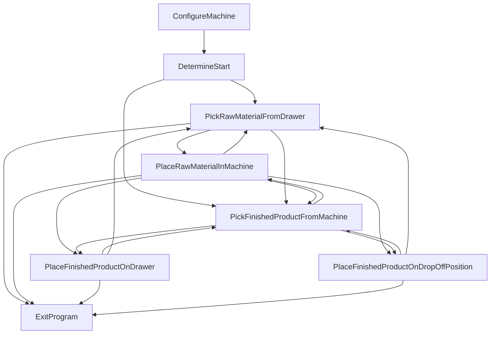

# Mermaid diagram

Below you can see the Mermaid diagram of the main.drl 
application. 

To see the graph install:

https://marketplace.visualstudio.com/items?itemName=bierner.markdown-mermaid

Then in VSCode you can do: "Markdown: open preview to the side"
to see the diagram.

# INPUT_OUTPUT

## TWO_SPINDLES_TWO_GRIPPERS

0. Cobot picks up raw product with first gripper and moves to the machine
and waits for the door to be opened. It does not wait for the machine
call since the machine is empty.

1. Next the Cobot places the raw material into the machines main spindle
with the first gripper.

2. The Cobot now moves to the drawer and picks up a raw product
with the first gripper. 

3. The Cobot now moves to outside of the machine, and waits for the 
machine to call the Cobot, then waits for the door to be opened again.

4. The Cobot picks the finished product from the sub spindle with the 
second gripper.

5. Next the Cobot places the raw material into the machines main spindle
with the first gripper.

6. The Cobot now moves to the drawer and places the finished product 
with the second gripper.

7. The Cobot now picks up a raw material, from the drawer, with the 
first gripper and the "loop" starts again, at step 3.

When the required number of products are produced the program ends.

Questions:

1. Should the Cobot pick the finished material first or place the 
raw material?

## ONE_SPINDLE_TWO_GRIPPERS

1. Cobot picks up raw product with first gripper and moves to the machine
and waits for the door to be opened. It does not wait for the machine
call since the machine is empty.

2. Next the Cobot places the raw material into the machines main spindle
with the first gripper.

3. The Cobot now moves to the drawer and picks up a raw product
with the first gripper. 

4. The Cobot now moves to outside of the machine, and waits for the 
machine to call the Cobot, then waits for the door to be opened again.

5. The Cobot picks the finished product from the main spindle with the 
second gripper.

6. Next the Cobot places the raw material into the machines main spindle
with the first gripper.

7. The Cobot now moves to the drawer and places the finished product 
with the second gripper.

8. The Cobot now picks up a raw material, from the drawer, with the 
first gripper and the "loop" starts again, at step 4.

When the required number of products are produced the program ends.

## TWO_SPINDLES_ONE_GRIPPER

1. Cobot picks up raw product with first gripper and moves to the machine
and waits for the door to be opened. It does not wait for the machine
call since the machine is empty.

2. Next the Cobot places the raw material into the machines main spindle.

3. The Cobot now moves to the drawer and picks up a raw product
with the first gripper. 

4. The Cobot now moves to outside of the machine, and waits for the 
machine to call the Cobot, then waits for the door to be opened again.

5. The Cobot places the raw product into the main spindle with the 
first gripper.

6. The Cobot picks the finished product from the sub spindle with the 
first gripper.

7. The Cobot now moves to the drawer and places the finished product
with the first gripper.

8. The Cobot now picks up a raw material with the first gripper and 
the "loop" starts again, at 4.

When the required number of products are produced the program ends.

## ONE_SPINDLE_ONE_GRIPPER

1. Cobot picks up raw product with first gripper and moves to the machine
and waits for the door to be opened. It does not wait for the machine
call since the machine is empty.

2. Next the Cobot places the raw material into the machines main spindle
with the first gripper.

3. The Cobot now moves to outside of the machine, and waits for the 
machine to call the Cobot, then waits for the door to be opened again.

4. The Cobot picks the finished product from the main spindle, with the 
first gripper.

5. The Cobot now moves to the drawer and places the finished product
with the first gripper.

6. The Cobot now picks up a raw material with the first gripper and 
the "loop" starts again.

When the required number of products are produced the program ends.

BTW What really happens:
1. Do configure sequence
2. Do homing sequence

// LOOP
3. Pickup raw product from the drawer with gripper 1
4. Wait machine call
5. Move to machine
6. Wait door open
7. Place raw product into machine with gripper 1
8. Move to drawer
9. Move to machine
10. Wait door open
11. Pickup finished product from machine with gripper 1
12. Move to drawer
13. Place finished product on drawer.
// REPEAT LOOP
14.

# INPUT

NOTE: the input scenario does not use the second gripper, and does
not interact with the sub spindle at all!

1. Cobot picks up raw product with first gripper and moves to the machine
and waits for the door to be opened. It does not wait for the machine
call since the machine is empty.

2. Next the Cobot places the raw material into the machines main spindle
with the first gripper.

3. The Cobot now moves to the drawer and picks up a raw product
with the first gripper. 

4. The Cobot now moves to outside of the machine, and waits for the 
machine to call the Cobot, then waits for the door to be opened again.

5. Next the Cobot places the raw material into the machines main spindle
with the first gripper.

6. The Cobot now picks up a raw material, from the drawer, with the 
first gripper and the "loop" starts again at 4.

When the required number of products are produced the program ends.

# OUTPUT

## TWO_SPINDLES_TWO_GRIPPERS

1. The Cobot moves to outside of the machine, and waits for the 
machine to call the Cobot, then waits for the door to be opened.

2. The Cobot picks the finished product from the sub spindle with the 
second gripper.

3. The Cobot now moves to the drawer and places the finished product 
with the second gripper.

4. The Cobot moves back to the machine and waits for the "loop" to 
start again, at step 1.

When the required number of products are produced the program ends.

Question: should it simply always use the first gripper instead of
using the second gripper. 

## ONE_SPINDLE_TWO_GRIPPERS
1. The Cobot moves to outside of the machine, and waits for the 
machine to call the Cobot, then waits for the door to be opened.

2. The Cobot picks the finished product from the main spindle with the 
second gripper.

3. The Cobot now moves to the drawer and places the finished product 
with the second gripper.

4. The Cobot moves back to the machine and waits for the "loop" to 
start again, at step 1.

When the required number of products are produced the program ends.

Question: should it simply always use the first gripper instead of
using the second gripper. 

## TWO_SPINDLES_ONE_GRIPPER

1. The Cobot moves to outside of the machine, and waits for the 
machine to call the Cobot, then waits for the door to be opened.

2. The Cobot picks the finished product from the sub spindle with the 
first gripper.

3. The Cobot now moves to the drawer and places the finished product 
with the first gripper.

4. The Cobot moves back to the machine and waits for the "loop" to 
start again, at step 1.

When the required number of products are produced the program ends.

## ONE_SPINDLE_ONE_GRIPPER

1. The Cobot moves to outside of the machine, and waits for the 
machine to call the Cobot, then waits for the door to be opened.

2. The Cobot picks the finished product from the main spindle, with the 
first gripper.

3. The Cobot now moves to the drawer and places the finished product
with the first gripper.

4. The Cobot moves back to the machine and waits for the "loop" to 
start again, at step 1.

When the required number of products are produced the program ends.
